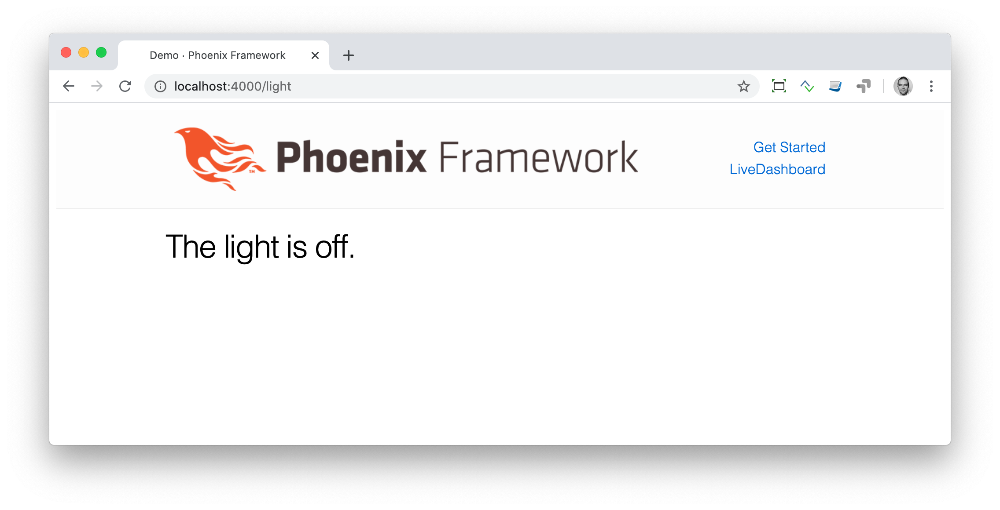
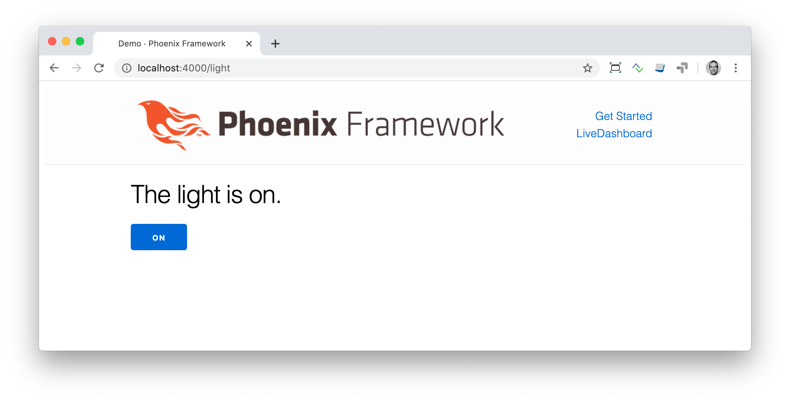

[[phoenix-liveview-basics]]
## Phoenix LiveView Basics

LiveView is an interesting alternative to single page JavaScript applications which get and post data from and to the server via JSON. 
Of course that can be done with Phoenix too. But it always involves 
some sort of JavaScript framework which adds to your tech stack. 
LiveView is a one-stop-shop for these kinds of functionality. And 
you don't even have to learn JavaScript to use it!

### The Light Switch

The light switch is the "Hello World!" of LiveView. 

NOTE: I stole the idea from the great Pragmatic Studio online course at 
https://online.pragmaticstudio.com/courses/liveview

We start with a fresh Phoenix application:

[source,shell]
----
$ mix phx.new demo --live --no-ecto <1>
* creating demo/config/config.exs
* creating demo/config/dev.exs
* creating demo/config/prod.exs

[...]

Fetch and install dependencies? [Yn] <2>

[...]

We are almost there! The following steps are missing:

    $ cd demo

Start your Phoenix app with:

    $ mix phx.server

You can also run your app inside IEx (Interactive Elixir) as:

    $ iex -S mix phx.server
----
<1> '--live' adds all the needed stuff to use LiveView out of the box. For this example we don't need Ecto.
<2> Always `Y` and depending on your internet connection a good time for a cup of coffee.

The aim of this demo is a new webpage with the path `/light` which offers a
status of a virtual light bulb and a switch functionality to turn on/off that
light bulb. All this without reloading the page and without any JavaScript.

First we have to add the route:

lib/hello_world_web/router.ex
[source,elixir]
----
defmodule DemoWeb.Router do
  use DemoWeb, :router

  [...]

  scope "/", DemoWeb do
    pipe_through :browser

    live "/", PageLive, :index <1>
    live "/light", LightLive <2>
  end

  [...]
----
<1> Because we created the app with the `--live` switch the default root path is already a live view. Therefor the `live` macro is used here (at the beginning of the line) instead of the traditional `get`.
<2> This is the new `light` route which leads to the `LightLive` module.

LiveView modules are located in the `lib/demo_web/live/` directory. There we have to create 
our new `LightLive` module:

lib/demo_web/live/light_live.ex
[source,elixir]
----
defmodule DemoWeb.LightLive do
  use DemoWeb, :live_view

  def render(assigns) do <1>
    ~L"""
    <h1>The light is off.</h1>
    """
  end
end
<1> The `render/1` function renders the template. We use the `~L` sigil to define the template.
----

[NOTE] 
====
We use the `~L` sigil to store the template code in this controller. It is easier for the purpose of this demo. Normaly you'd have that code probably in a file and use this code in the controller: 

```
def render(assigns) do
  Phoenix.View.render(DemoWeb.LightLive, "light.html", assigns)
end
```

Have a look at https://hexdocs.pm/phoenix_live_view/Phoenix.LiveView.html for more information.
====

Now we can open the browser and open the URL `http://localhost:4000/light`



Our aim is to change the world `off` to `on` and trigger that by a button. For that to 
happen we first have to replace the current word with a variable and we have to assign 
that variable to the socket struct (which is used to transport that information). We assign 
the initial state of the variable `light_bulb_status` in the `mount/3` function.

lib/demo_web/live/light_live.ex
[source,elixir]
----
defmodule DemoWeb.LightLive do
  use DemoWeb, :live_view

  def mount(_params, _session, socket) do <1>
    socket = assign(socket, :light_bulb_status, "off") <2>
    {:ok, socket}
  end

  def render(assigns) do
    ~L"""
    <h1>The light is <%= @light_bulb_status %>.</h1>
    """
  end
end
----
<1> Out of all the posssible parameters of `mount/3` we only need the `socket` struct for our example.
<2> We assign the value `off` to the variable `light_bulb_status`

The browser automatically reloads but the page's content hasn't changed. Only we know that the `off` 
is not a static content any more.

To turn on the light bulb we need a button:

[source,elixir]
----
def render(assigns) do
  ~L"""
  <h1>The light is <%= @light_bulb_status %>.</h1>
  <button phx-click="on">On</button> <1>
  """
end
----
<1> The button tag includes `phx-click="on"` which is special Phoenix code to trigger an event.

Now we see the button on the webpage:

image::images/liveview-on-button.png[http://localhost:4000/light]

But clicking on the button doesn't do anything. We have to add a `handle_event/3` function for the `on` event:

lib/demo_web/live/light_live.ex
[source,elixir]
----
defmodule DemoWeb.LightLive do
  use DemoWeb, :live_view

  def mount(_params, _session, socket) do
    socket = assign(socket, :light_bulb_status, "off")
    {:ok, socket}
  end

  def render(assigns) do
    ~L"""
    <h1>The light is <%= @light_bulb_status %>.</h1>
    <button phx-click="on">On</button>
    """
  end

  def handle_event("on", _value, socket) do <1>
    socket =
      socket
      |> assign(:light_bulb_status, "on") <2>

    {:noreply, socket}
  end
end
----
<1> We don't need the `_value` parameter. Just the first parameter to match the function and the socket struct.
<2> We set the `light_bulb_status` variable to `on`.

[NOTE] 
====
To use the pipe operator in the `handle_event/3` function is kind of overkill for 
just one variable. In that case it would make sense to use this code:

```
def handle_event("on", _value, socket) do
  {:noreply, assign(socket, :light_bulb_status, "on")}
end
```

Same argument works for the `mount/3` function:

```
def mount(_params, _session, socket) do
  {:ok, assign(socket, :light_bulb_status, "off")}
end
```
====

No we can load the page having the light `off`. After clicking on the button 
the text updates to `on`.



But it would be nice to add a second button so that we can switch the light off 
again. In addition we have to add an other event handler for the `off` event:

lib/demo_web/live/light_live.ex
[source,elixir]
----
defmodule DemoWeb.LightLive do
  use DemoWeb, :live_view

  def mount(_params, _session, socket) do
    socket = assign(socket, :light_bulb_status, "off")
    {:ok, socket}
  end

  def render(assigns) do
    ~L"""
    <h1>The light is <%= @light_bulb_status %>.</h1>
    <button phx-click="on">On</button>
    <button phx-click="off">Off</button>
    """
  end

  def handle_event("on", _value, socket) do
    socket =
      socket
      |> assign(:light_bulb_status, "on")

    {:noreply, socket}
  end

  def handle_event("off", _value, socket) do
    socket =
      socket
      |> assign(:light_bulb_status, "off")

    {:noreply, socket}
  end  
end
----

Now we have a webpage with two buttons which work to turn the imaginary light on and off. 
But I don't like that both buttons are active all the time. That is bad UX. Let's 
fix that:

lib/demo_web/live/light_live.ex
[source,elixir]
----
defmodule DemoWeb.LightLive do
  use DemoWeb, :live_view

  def mount(_params, _session, socket) do
    socket =
      socket
      |> assign(:light_bulb_status, "off")
      |> assign(:on_button_status, "") <1>
      |> assign(:off_button_status, "disabled")

    {:ok, socket}
  end

  def render(assigns) do
    ~L"""
    <h1>The light is <%= @light_bulb_status %>.</h1>
    <button phx-click="on" <%= @on_button_status %>>On</button>
    <button phx-click="off" <%= @off_button_status %>>Off</button> <2>
    """
  end

  def handle_event("on", _value, socket) do
    socket =
      socket
      |> assign(:light_bulb_status, "on")
      |> assign(:on_button_status, "disabled") <3>
      |> assign(:off_button_status, "")

    {:noreply, socket}
  end

  def handle_event("off", _value, socket) do
    socket =
      socket
      |> assign(:light_bulb_status, "off")
      |> assign(:on_button_status, "")
      |> assign(:off_button_status, "disabled")

    {:noreply, socket}
  end
end
----
<1> We assign a value for the `on_button_status` and `off_button_status` to make the on button active and the off button inactive at the start.
<2> We use the `@off_button_status` to disable the off button right at the beginning.
<3> We toggle the values of the buttons.

We are all set. The buttons work in the way a user would like them to work. All
without writing a single line of JavaScript. Phoenix LiveView takes care of all
that. We can concentrate on the application development with Elixir.

image::images/liveview-working-on-off-button.png[http://localhost:4000/light]